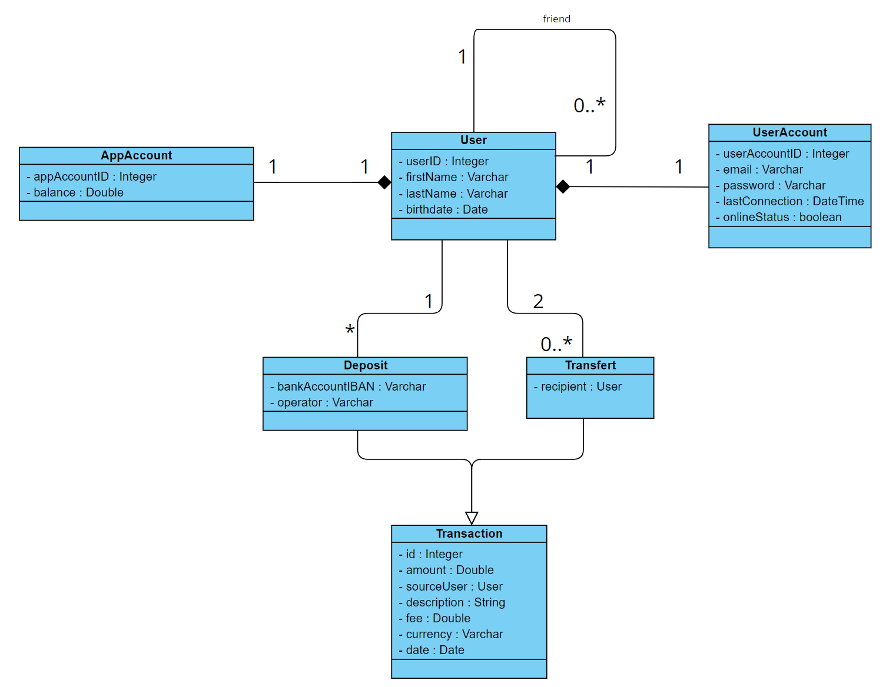
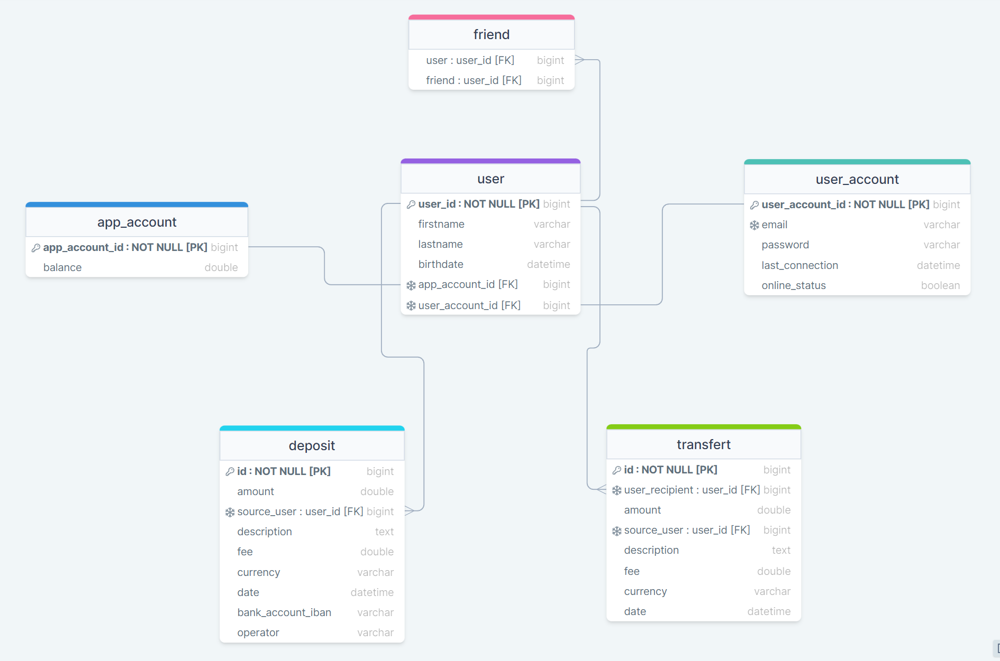

# Pay My Buddy :

Web application develop in Java. 

We make moving your money easy!

The aim of this application is to simplify money transfers for people in order to pay their friends or handle their financies.
Turning money transfer that can be inconvenient into easy, secured and quick transaction.

You simply need to registrer and add funds to your app account, in order to send money in one click to your friends that can be add by their email.

Available for all platforms (PC, tablets, phones)

-------------------------------------------------------------------------------------------------------------------------------------

## App Configuration :

- Java 17 
- Maven 3.8.7 
- Spring Boot 3.0.2
- Maven dependencies : (Lombok / Spring Web / Spring Data JPA / Spring Security / OAuth2 / MySQL Driver / Thymeleaf)
- SQL script for creating database in : src/main/resources/data.sql

- Properties in : src/main/resources/application.properties
- Server port 8080 (http://localhost:8080)
- BCRYPT to encode password in database

-------------------------------------------------------------------------------------------------------------------------------------

## Getting Started :

- Install Maven
- Install Java
- Install My SQL

-> Copy project from Github on your local machine

-> Create a MySQL server on your local machine with credential (username=pierredb + password=a627a158-1cd5-4ab1-a439-0d4873785246)

-> Go to the root of the application and execute mvn spring-boot:run

-> The server port is 8080

-> Tests can be run with Maven

-> When you are on the application login page, you can connect with the username = edenarnold@gmail.com and password = eden

-------------------------------------------------------------------------------------------------------------------------------------

## Class Diagram :

-------------------------------------------------------------------------------------------------------------------------------------

## Physical Data Model :

-------------------------------------------------------------------------------------------------------------------------------------
